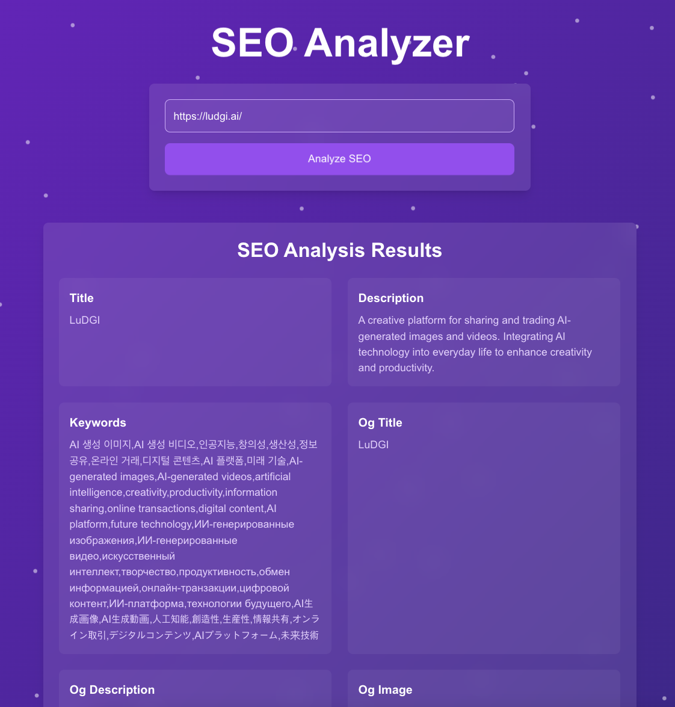

# SEO Analyzer

A powerful and user-friendly tool for extracting and analyzing SEO metadata from websites. Simply input a URL to instantly retrieve key SEO elements including title, description, keywords, Open Graph tags, and more. Built with Next.js for efficient server-side rendering and API functionality.

# deploy

- https://getseo.ludgi.ai

# sitemap

- https://getseo.ludgi.ai/sitemap.xml

# preview

